# scRNA-seq-nasal-mucosa
Single-cell RNA-seq analysis of mouse nasal mucosa to characterize cellular heterogeneity and host response to viral infection

**Author:** Rebekah Hest  
**Course:** BINF6110 - Genomic Methods for Bioinformatics

## Assignment 4

This repository contains Assignment 4, a scRNA-seq analysis of mouse nasal mucosa using Seurat, including clustering, manual cell type annotation, differential expression, and pathway enrichment to investigate cellular responses to viral infection

### Introduction

Single-cell RNA sequencing (scRNA-seq) has emerged as a powerful tool for studying gene expression in complex biological systems, offering key advantages over traditional bulk RNA sequencing (RNA-seq). While inexpensive, bulk RNA-seq methods average gene expression across many cells at the tissue level which can mask cell diversity and obscure cell-specific information (Mao et al., 2023). In contrast, scRNA-seq can isolate and capture transcriptional profiles at the individual cell-level, enabling characterization of heterogeneous cells and identification of distinct cell populations (Tzec-Interián, González-Padilla and Góngora-Castillo, 2025). This high-resolution technology can be used for the detection and classification of rare but functionally important cell types with applications in disease diagnosis and treatment (Jovic et al., 2022).
  
This approach is particularly valuable for investigating virus-host interactions and informing the development of therapeutics and vaccines (Chang et al., 2024). Respiratory viral infections, including Influenza A Virus (IAV), typically enter the body through the mouth or nose, where the nasal epithelium serves as a critical immunological barrier (Denney and Ho, 2018). The nasal epithelium is a complex and heterogeneous tissue composed of multiple major and rare cells and the nasal mucosa is highly dynamic, exhibiting changes in response to environmental and infectious stimuli (Cybulski et al., 2026). Such heterogeneity and plasticity make it essential to study gene expression at single-cell resolution in order to fully capture the range of cellular responses to infection and understand how these responses contribute to disease progression and immune defense.
	However, the advantages of scRNA-seq come with increased analytical complexity. Compared to bulk RNA-seq, scRNA-seq data are high-dimensional, sparse, and subject to technical variability such as dropout events and batch effects (Kharchenko, 2021). As a result, analysis requires a multi-step pipeline including quality control, normalization, dimensionality reduction, clustering, and cell type annotation before meaningful biological comparisons can be made (Chen, Ning and Shi, 2019).
    
Within the scRNA-seq framework, several methodological choices exist at each stage of analysis. To reduce technical noise of scRNA-seq data, normalization is an essential step that will benefit downstream analyses. Traditional log-normalization methods, such as those implemented in Seurat, scale gene expression values by sequencing depth and apply a logarithmic transformation, offering a simple and computationally efficient approach (Stuart et al., 2019). In contrast, more advanced methods such as SCTransform use a model-based framework based on regularized negative binomial regression to account for technical noise and variance across genes, often improving clustering and differential expression analyses (Hafemeister and Satija, 2019). Clustering is a key step in scRNA-seq analysis, as it enables the identification of distinct cell populations based on transcriptional similarity. Partition-based methods such as k-means require the number of clusters to be specified a priori, which can be limiting in complex and heterogeneous datasets and can be sensitive to outliers resulting in failures to detect rare cell types (Zhang et al., 2023). In contrast, graph-based approaches (e.g., Seurat’s FindClusters) use cell–cell similarity networks to identify clusters in a data-driven manner, making them better suited for capturing the structure of single-cell data. Finally, differential expression analysis in scRNA-seq can be performed either at the single-cell level or by aggregating counts across cells within clusters (pseudobulk). Single-cell methods, such as MAST, model expression at the level of individual cells but can be sensitive to technical noise and inflated false positive rates. In contrast, pseudobulk approaches using tools such as DESeq2 aggregate counts by sample and cell type, providing more robust statistical inference and improved control of false positives, making them a preferred approach for many scRNA-seq studies (Kalantari-Dehaghi, Ghohabi-Esfahani and Emadi-Baygi, 2025).
  
In this study, a scRNA-seq dataset from Kazer et al. (2025) of murine nasal mucosa will be analyzed to investigate the spatial and temporal variation in host response across distinct tissue types. To address these objectives, a Seurat-based analysis pipeline including clustering and UMAP visualization, cell type annotation, differential expression analysis, and pathway enrichment analysis will be applied. These methods were selected to balance biological interpretability with statistical rigor, enabling the identification of key cell populations and transcriptional pathways involved in the immune response to viral infection.

### Methods

#### Data Acquisition and Quality Control
Single-cell RNA sequencing data were obtained from Kazer et al. (2025) as a pre-processed Seurat (v.5.4.0) object (`readRDS`) containing gene expression counts and associated metadata. The dataset included cells from murine nasal tissues collected across multiple time points: 0 (naïve), 2, 5, 8, and 14 days post infection (DPI), and tissues: olfactory (OM), respiratory (RM), and lateral nasal gland (LNG) following influenza A virus infection.
  
Quality control was performed to remove low-quality cells based on visualization of gene count, UMI count, and mitochondrial gene expression distributions using violin plots (`VlnPlot`). The percentage of mitochondrial gene expression was calculated using genes with the prefix “mt-” (`PercentageFeatureSet`), and cells with greater than 10% mitochondrial content (`percent.mt < 10`) were removed. Cells with fewer than 500 detected genes (`nFeature_RNA > 500`) were excluded to remove low-quality cells or empty droplets. 

#### Normalization and Feature Selection
Gene expression data were normalized using the log-normalization method implemented in Suerat (`NormalizeData`). Although SCTransform provides a model-based approach that accounts for technical variation, it was not used due to computational constraints associated with the size of the dataset.
  
Highly variable genes were identified (`FindVariableFeatures`) using the variance-stabilizing transformation (vst) method, where the top 2000 features were selected to capture genes that drive cell variability and reduce noise. The data were then scaled (`ScaleData`) to equalize gene expression values for downstream analyses.

#### Dimensionality Reduction and Clustering
Principal component analysis (PCA) was performed to reduce dimensionality and highlight similarity patterns in the data (`runPCA`). An elbow plot was generated to determine the number of principal components used for downstream analysis, with the first 15 components selected as they captured the majority of variance prior to plateauing (`ElbowPlot`).
  
Graph-based clustering was performed using the Seurat `FindNeighbors` and `FindClusters` functions based on the selected principal components. Multiple clustering resolutions were evaluated, and a resolution of 0.5 was selected as it produced well-separated clusters without the over-fragmentation observed at higher resolutions (e.g., 0.8). Uniform Manifold Approximation and Projection (UMAP) was used to efficiently visualize high-dimensional single-cell data into interpretable clusters (`RunUMAP`, `DimPlot`).

#### Batch Effect Correction
Potential batch effects were assessed by visualizing UMAPs coloured by sample metadata, including time points, mouse identities, and disease condition.

#### Cell Type Annotation and Visualization
Cell type annotation was performed using a manual, marker-based approach. Cluster-specific marker genes were identified using Seurat’s `FindAllMarkers` function with a log fold-change threshold of 0.25. For each cluster, the top five marker genes ranked by average log2 fold-change were selected to represent dominant expression signatures.
  
Clusters were classified into cell types according to the known cell type(s) of the dominant marker genes through a literature search with consideration of the biological context of nasal mucosa tissue. In cases where clusters exhibited mixed or ambiguous marker profiles, cell type identities were consolidated based on the predominant expression pattern across multiple markers.
  
Feature plots were generated throughout the annotation process to visualize the spatial distribution and specificity of marker gene expression across clusters, enabling validation of candidate cell type assignments (`FeaturePlot`). Representative feature plots were generated for both well-defined clusters and clusters with mixed marker signatures, as well as for key marker genes across major cell types.
Following annotation, cluster identities were relabeled using Seurat’s `RenameIdents` function, and annotated cell types were visualized using UMAP with cluster labels displayed.

#### Differential Expression Analysis
The Seurat object was inspected for NA or missing data and samples missing Mouse identifiers (IDs) were removed to ensure independent biological replicates and to exclude potential doublets or ambiguous cell assignments. 
  
To account for biological replication, gene expression counts were aggregated across cells for each mouse–timepoint combination (n = 10) and mouse–tissue combination (n = 3) using Seurat’s `AggregateExpression()` function. 
This pseudobulk approach enabled differential expression testing at the level of biological replicates, rather than individual cells. Differential expression analysis was performed using Seurat’s `FindMarkers` function with the `DESeq2` method to account for between-sample variability by modelling counts using a negative binomial distribution and reduce false positives (Love et al., 2014).
  
Volcano plots were generated for the time point comparisons relative to  2 (peak viral infection), excluding Naïve (URT infection) (n=3), and for each tissue type comparison (n=3). 

#### Functional Enrichment Analysis
Over-representation analysis (ORA) was conducted using the `enrichGO` function from clusterProfiler (v.4.16.0) using the `org.Mm.eg.db` Mouse annotation database (v.21.0). Genes were filtered based on an adjusted p-value < 0.05 and an absolute log2 fold-change > 0.25, consistent with commonly used thresholds in single-cell RNA-seq Seurat workflows to capture biologically meaningful expression changes while filtering out technical noise. Gene Ontology (GO) Biological Process (BP) terms were evaluated using gene symbols as identifiers, with Benjamin-Hochberg multiple testing correction applied. A background universe consisting of a unique list of the tested genes was used to control for selection bias and results were visualized using a dot plot (`dotplot`).

### Results

#### Cell Clustering Reveals Distinct Populations
Quality control filtering was performed by assessing feature counts and mitochondrial gene expression. Comparable distribution of these metrics was observed across time points, and thresholds were applied accordingly to remove low-quality cells and potential outliers (n=149064; Figure 1).
  

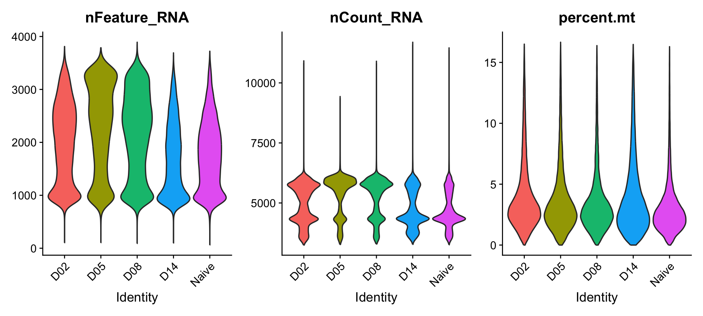 
**Figure 1. Violin plots showing distributions of detected genes (nFeature_RNA), total counts (nCount_RNA), and mitochondrial gene percentage (percent.mt) across timepoints (days post infection: D02, D05, D08, D14, and naive to assess data quality and guide filtering thresholds.**

Principal component analysis (PCA) was performed to reduce dimensionality, and the first 15 principal components were selected for downstream clustering based on the elbow plot (Figure 2). 

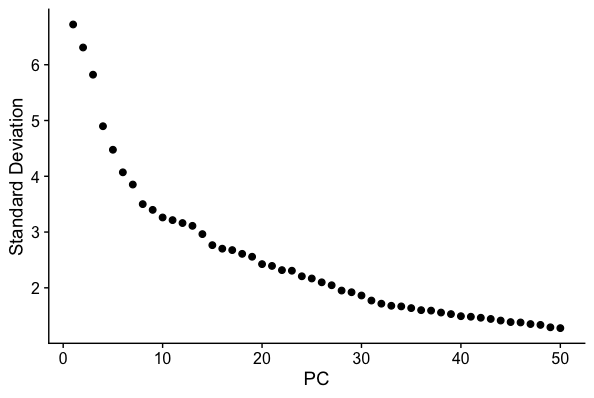 
**Figure 2. Elbow plot showing the standard deviation explained by each principal component (PC). The point of inflection indicates the number of PCs retained for downstream analyses (nPCs = 15).**

UMAP visualization revealed clear separation of cells into distinct clusters, indicating substantial cellular heterogeneity within the dataset (Figure 3). 

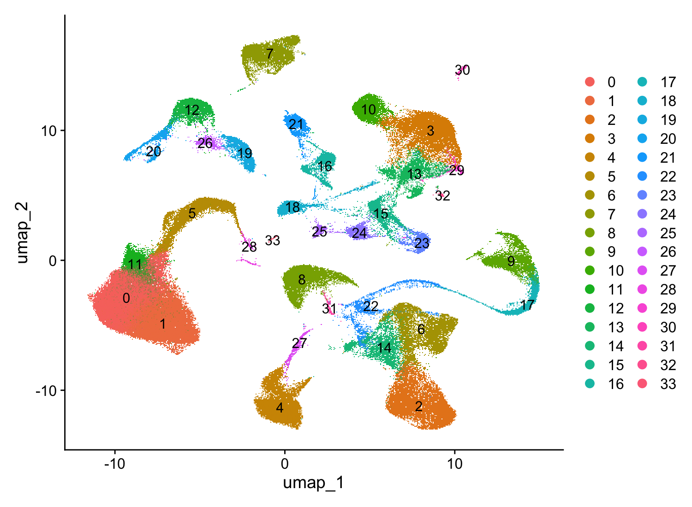 
**Figure 3. UMAP plots colored by (A) disease state (influenza vs. normal), (B) timepoint (D02, D05, D08, D14, naive), and (C) individual mouse ID. Cells are well-mixed across conditions and replicates, indicating negligible batch effects.**

Clustering at a resolution of 0.5 produced well-defined and biologically interpretable groups within excessive fragmentation. UMAPs grouped by timepoints, disease condition and mouse identities showed strong mixing of cells by these variables (Figure 4). This suggests that clustering was driven by biological variation rather than technical artifacts and therefore, no batch effect correction was applied. 

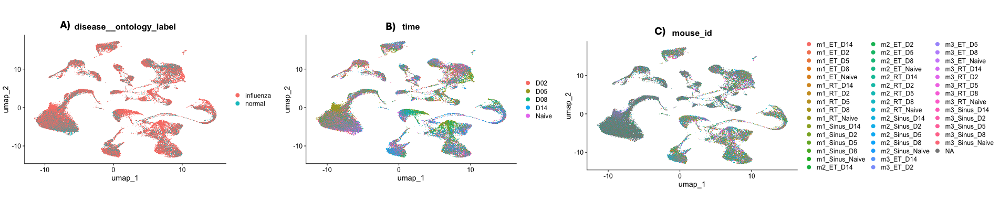 
**Figure 4. Uniform Manifold Approximation and Projection (UMAP) embedding of all cells colored by unsupervised cluster identity. A total of 34 transcriptionally distinct clusters (0–33) were identified based on shared gene expression profiles. Clusters represent heterogeneous cell populations.**

#### Manual Annotation Identifies Major Cell Types
Clusters were annotated based on the top five expressed genes by average log2 fold change. Feature plots demonstrated that several clusters exhibited consistent and cell type-specific expression patterns (Figure 5). 

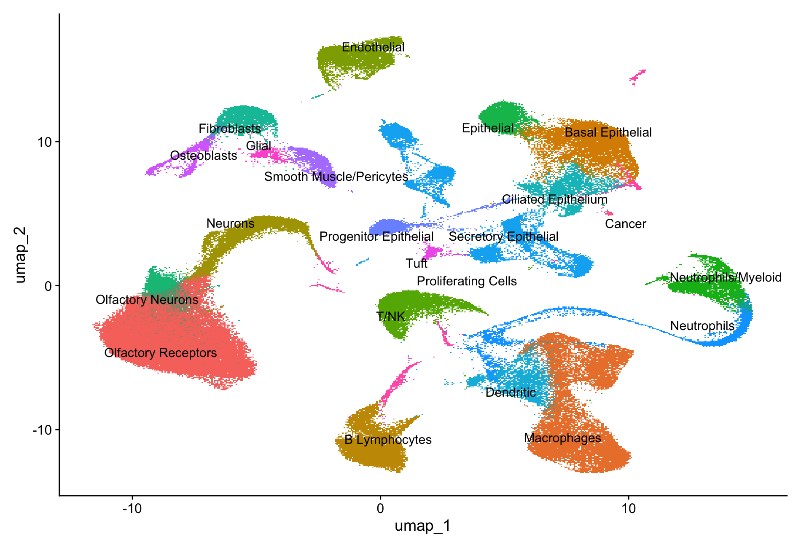 
**Figure 4. Uniform Manifold Approximation and Projection (UMAP) embedding of all cells colored by unsupervised cluster identity. A total of 34 transcriptionally distinct clusters (0–33) were identified based on shared gene expression profiles. Clusters represent heterogeneous cell populations.**

For example, cluster 4 showed strong and localized expression of B cell markers including _Iglc2_, _Fcmr_, _Iglc1_, _Ighd_, and _Ms4a1_ supporting its annotation as B lymphocytes (Figure 6). 

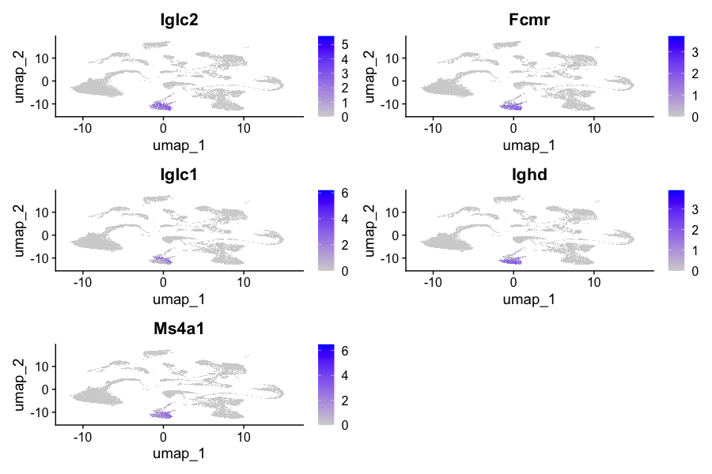 
**Figure 6. Feature plots showing expression of canonical B cell markers (Iglc2, Iglc1, Ighd, Ms4a1, Fcmr) in cluster 4. Expression is localized to a distinct cluster, supporting its annotation as B lymphocytes.**

In contrast, some clusters displayed more heterogenous expression. Cluster 33 contained expression of genes associated with multiple cell types, including glandular cells (_Sult1e1_), immune cells (_Tac4_), chondrocytes (_Col9a1_), epithelial (_Svopl_) and possible associations with proliferating cells (_Hist1h2ap_), suggesting a mixed or less well-defined cell type (Figure 7). 

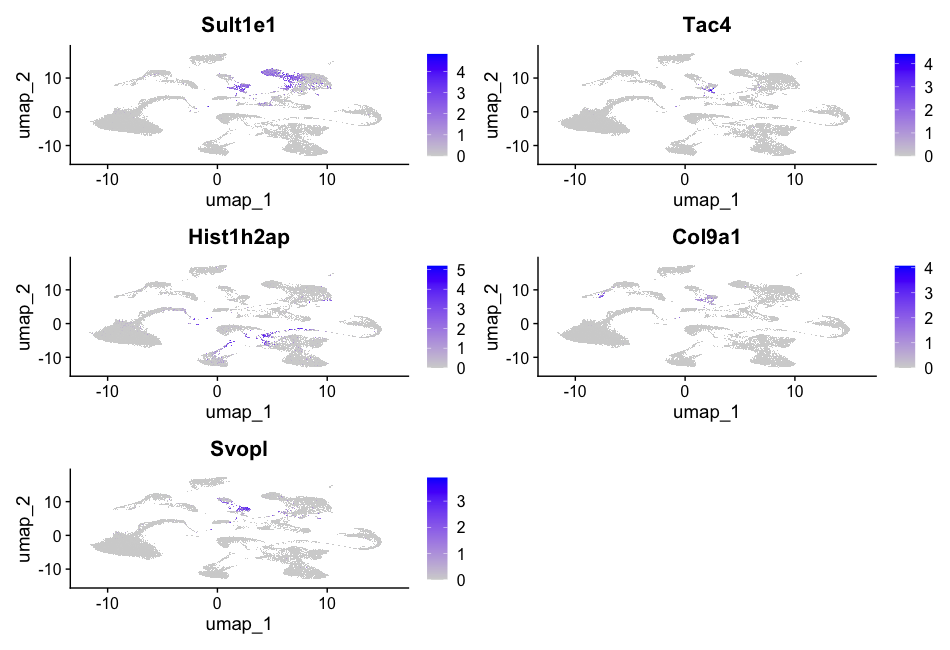 
**Figure 7.Feature plots showing expression of genes including Sult1e1, Tac4, Hist1h2ap, Col9a1, and Svopl in cluster 33. Expression is not localized, suggesting a mixed cell type.**

Feature plots of marker genes across multiple clusters further confirmed the separation of cell type populations, including basal epithelium (_Krt15_), macrophages (_Ms4a7_), neutrophils (_Ly6g_), B cells (_Ms4a1_), and endothelial (_Ptprb_) (Figure 8). 

 
**Figure 8. Feature plots displaying representative markers for key cell types, including epithelial (Krt15), macrophages (Ms4a7), neutrophils (Ly6g), B cells (Ms4a1), and endothelial cells (Ptprb). Distinct expression patterns validate cell type annotations.**

Given the focus on immune response to viral infection, macrophages were selected for downstream analysis. Genes associated with macrophages in cluster 2, including _Cd209f_, _Cd5l_, and _Ms4a7_ showed clustering, confirming the cell type of this population (Figure 9). 

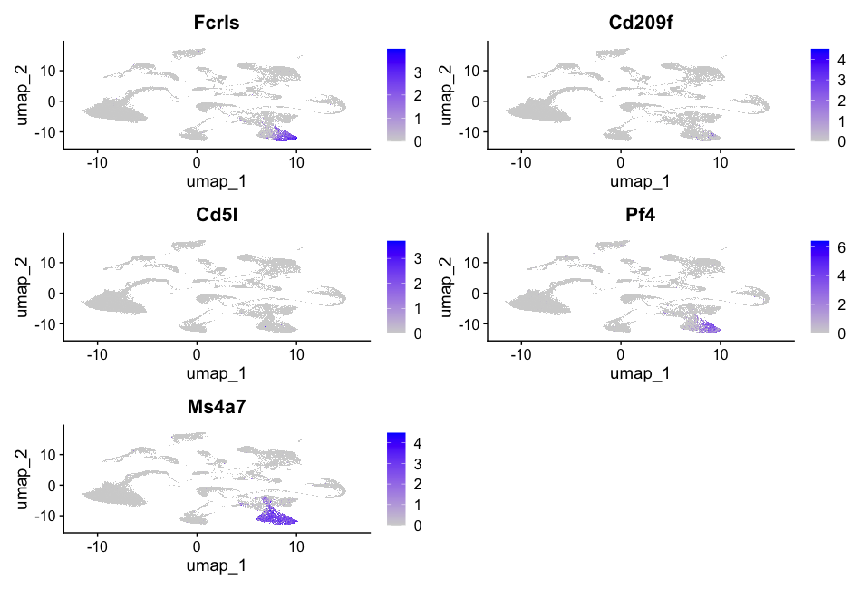 
**Figure 9. Feature plots showing expression of macrophage amarkers (Fcrls, Cd209f, Cd5l, Pf4, Ms4a7). Expression is localized, supporting its annotation as Macrophages and will be used for downstream analyses.**

#### Temporal Changes and Tissue-Specific Differences in Macrophage Gene Expression
Differential expression analysis was performed on macrophages to compare gene expression across viral infection time points. Pairwise comparisons revealed substantial differences, with 594 genes differentially expression between 2 and 5 DPI, 667 genes between 2 and 8 DPI, and 267 genes between 2 and 14 DPI (adjustsed p-value < 0.05, |log2 fold-change| > 0.25). Volcano plots demonstrated clear separation of upregulated and downregulated genes across all timepoint comparisons (Figure 10).
  

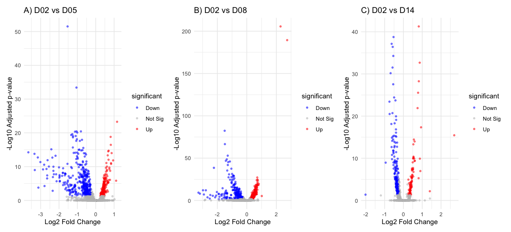 
**Figure 10. Volcano plots showing differential expression between days post infection: D02 vs D05 (A), D02 vs D08 (B), and D02 vs D14 (C). Significantly upregulated (red) and downregulated (blue) genes are highlighted based on adjusted p-value < 0.05 and | log2 fold-change thresholds | > 0.25.**

Differential expression analysis across tissue types also revealed notable transcriptional variation. Comparisons identified 832 genes differentially expressed between OM (and RM, 773 genes between OM and LNG, and 1114 genes between RM and LNG. Likewise, volcano plots show evidence of differential expression in separation of upregulated and downregulated genes across all tissue type comparisons (Figure 11). 

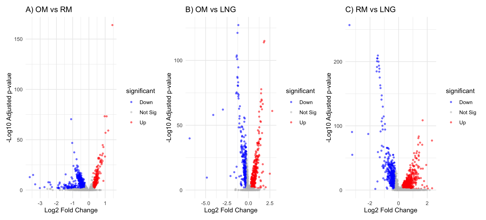 
**Figure 11. Volcano plots showing differential expression between tissue types olfactory mucosa (OM), respiratory mucosa (RM), and lung (LNG): OM vs RM (A), OM vs LNG (B), and RM vs LNG (C). Significantly upregulated (red) and downregulated (blue) genes are highlighted based on adjusted p-value < 0.05 and | log2 fold-change thresholds | > 0.25.**

#### Functional Enrichment Varies Across Timepoint and Tissue Comparisons
Across temporal contrasts, the number of significantly enriched Gene Ontology (GO) terms varied widely, with 2 and 5 DPI (n=995) and 2 and 8 DPI (n=617) showing extensive enrichment, while 2 and 14 DPI (n=14) exhibited markedly fewer significant terms. Early timepoint comparisons were strongly enriched in processes relating to viral response and regulation of defence mechanisms (Figure 12A-B), while the late timepoint comparison reflected translation and T cell differentiation processes (Figure 12C).
  

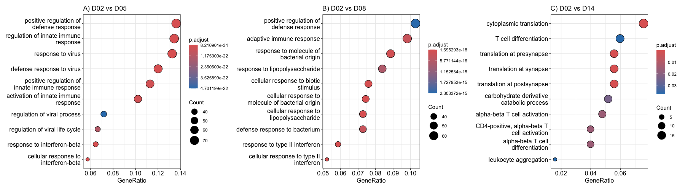 
**Figure 12. Dot plots showing enriched Gene Ontology (GO) Biological Processes (BP) for differentially expressed genes across timepoints: D02 vs D05 (A), D02 vs D08 (B), and D02 vs D14 (C). Enriched terms include antiviral responses, innate immune activation, and adaptive immune processes, reflecting dynamic immune responses over time.**

A similar pattern of extensive enrichment was observed across tissue comparisons, with all contrasts yielding a high number of significant GO terms (OM vs RM: n=987; OM vs LNG: n=965; RM vs LNG: n=1231). Enriched pathways across all tissue types were predominately associated with immune cell signalling and movement (Figure13A-C).

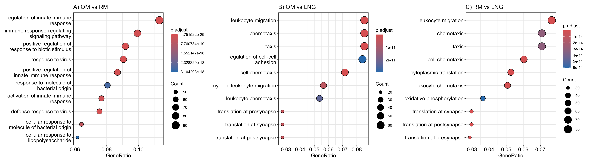 
**Figure 13. Dot plots showing enriched Gene Ontology (GO) Biological Processes (BP) for differentially expressed genes across tissues: OM vs RM (A), OM vs LNG (B), and RM vs LNG (C). Enrichment of pathways such as leukocyte migration, chemotaxis, and immune regulation highlights functional differences between anatomical sites.**

### Discussion
This study used scRNA-seq data to examine spatial and temporal variation in the host immune response to viral infection within the murine nasal mucosa. Through clustering, pseudobulk differential expression, and functional enrichment analyses, distinct cell populations were identified and characterized by dynamic transcriptional changes in macrophages across both time points and tissue types. 
  
Clustering analysis revealed a complex mix of epithelial, stromal and immune cell populations which play key roles in maintaining homeostasis and antiviral defense, reflecting the expected heterogeneity of the nasal mucosa (Scherzad, Hagan and Hackenberg, 2019; Zhou et al., 2025). Epithelial subtypes, including ciliated and goblet cells (eg. _AU040972_) contribute to frontline defence through mucociliary clearance (Bustamante-Marin and Ostrowski, 2017). Stromal fibroblasts (eg. _Mmp3_) further support immune function by modulating extra cellular matrix composition and drive inflammatory processes (Ball et al., 2016). Among immune cell populations, macrophages (eg. _Cd5l_) are key regulators of antiviral responses through phagocytosis and cytokine production, with the capacity for dynamic transcriptional and functional reprogramming in response to environmental cues (Wang, Wang and Ho, 2024). Given the functional plasticity exhibited by macrophages and their central role in immune response and tissue repair, the clusters representing macrophages were selected for further analysis.
  
Differential expression analysis of macrophages revealed pronounced temporal transcriptional changes over the course of viral infection. Comparisons between dpi 2 and both dpi 5 and 8 yielded a large number of differentially expressed genes, indicating early activation and peak response by mid-stage infection. In contrast, substantially fewer genes were differentially expressed between dpi 2 and 14, suggesting a reduction in transcriptional activity as viral clearance occurs. This pattern aligns with the known progression of macrophages during viral infection, characterized by an initial pro-inflammatory phase followed by a transition towards immune regulation and tissue repair as the infection resolves (Harris, 2014; Yu et al., 2024). 
  
In addition to temporal variation, macrophages exhibited significant tissue-specific gene expression, with numerous genes differing between groups, consistent with the capacity of macrophage subsets to adopt specialized transcriptional programmes to support tissue-specific structure, function and immune regulation (Mass et al., 2023). For example, respiratory mucosal (RM) macrophages serve as the primary barrier to inhaled pathogens, support antiviral defence and maintain homeostasis (Pace et al., 2024). In contrast, macrophages in the olfactory mucosa (OM) have been shown to maintain neuronal function and promote immune activation (Wellford et al., 2024). Similarly, the lateral nasal gland (LNG) comprises distinct immune profiles that may support macrophage surveillance and signalling (Gowanlock et al., 2026).
  
To further interpret the biological significance of macrophages, functional enrichment analysis was performed across timepoints and tissues. Comparisons of early infection periods were enriched with antiviral pathways, including interferon signalling and response to virus, consistent with the role of interferons as early regulators of innate antiviral immunity (Hoagland et al., 2023). Whereas later timepoint showed enrichment of processes such as translation and T cell differentiation, consistent with transition of macrophages toward controlling viral replication and increasing functional sensitivity for persistent or late-stage viral infections (Walker, Sewell and Klenerman, 2010). In addition to temporal patterns, enrichment of leukocyte migration, chemotaxis, and immune signaling suggests that macrophages coordinate immune responses across regions of the nasal mucosa. Migration-related processes in the respiratory mucosa support rapid immune cell recruitment at sites of pathogen exposure, while signaling pathways in the olfactory and lateral nasal mucosa reflect cell communication to coordinate immune responses, consistent with tissue-specific macrophage specialization (Jenkins and Allen, 2021).
  
Despite these strengths, several limitations should be considered. Cell type annotation was performed manually using a limited set of marker genes, which may introduce subjectivity and limit the resolution of closely related or transitional cell states. The use of pseudobulk differential expression improves statistical robustness but may obscure heterogeneity within macrophage populations. Additionally, the use of log-normalization rather than model-based approaches such as SCTransform may not fully account for technical variability. Future work could address these limitations by incorporating automated annotation methods or reference-based mapping to improve cell type classification, as well as trajectory inference approaches to model dynamic changes in cell states over time.
  
Overall, this study demonstrates that macrophage responses to viral infection are both temporally dynamic and spatially specialized, reflecting the complexity of host immune defense. These findings highlight the value of single-cell RNA-sequencing (scRNA-seq) in resolving cellular heterogeneity and advancing our understanding host cellular responses, including the identification of novel cell states, viral target cells, and key antiviral mechanisms (Zhang et al., 2026). 

## References
Ball, S. L., Mann, D. A., Wilson, J. A., & Fisher, A. J. (2016). The Role of the Fibroblast in Inflammatory Upper Airway Conditions. The American Journal of Pathology, 186(2), 225–233. https://doi.org/10.1016/j.ajpath.2015.09.020
Bustamante-Marin, X. M., & Ostrowski, L. E. (2017). Cilia and Mucociliary Clearance. _Cold Spring Harbor Perspectives in Biology_, _9_(4), a028241. https://doi.org/10.1101/cshperspect.a028241
  
Chang, J. T., Liu, L. B., Wang, P. G., & An, J. (2024). Single-cell RNA sequencing to understand host-virus interactions. Virologica Sinica, 39(1), 1–8. https://doi.org/10.1016/j.virs.2023.11.009
Chen G., Ning B., & Shi T. (2019). Single-Cell RNA-Seq Technologies and Related Computational Data Analysis. _Frontiers in Genetics_, _10_, 317. https://doi.org/10.3389/fgene.2019.00317
  
Cybulski, T., Sala, M. A., Nicholson, T., Klug, Z., Nelson, R., Yu, Z., Sokolenko, Y., Diaz, E., Swaminathan, S., Lu, Z., Markov, N. S., McKone, E. F., Misharin, A. V., & Jain, M. (2026). Single-cell RNAseq identifies persistent epithelial and immune dysfunction in PwCF by mitigating inter-individual sampling heterogeneity. _Journal of Cystic Fibrosis_. https://doi.org/10.1016/j.jcf.2026.01.009
  
Denney L., & Ho L. P. (2018). The role of respiratory epithelium in host defence against influenza virus infection. Biomedical Journal, 41(4):218-233. https://doi.org/10.1016/j.bj.2018.08.004
Finak, G., McDavid, A., Yajima, M., Deng, J., Gersuk, V., Shalek, A. K., Slichter, C. K., Miller, H. W., McElrath, M. J., Prlic, M., Linsley, P. S., & Gottardo, R. (2015). MAST: a flexible statistical framework for assessing transcriptional changes and characterizing heterogeneity in single-cell RNA sequencing data. _Genome Biology_, _16_, 278. https://doi.org/10.1186/s13059-015-0844-5
  
Gowanlock S. N., Lam V. H., Tepe Z. G., Park D. E., Tai V., Salazar J. E., Pham T., Khan Y., Nelson S., Horn C., Zuanazzi D., Yang D., Price L. B., Kaul R., Sowerby L., Troyer R. M., Liu C. M., & Prodger J. L. (2026). The adult nasal mucosa is defined by distinct immune profiles that modulate in-vitro SARS-CoV-2 infection. Res Sq [Preprint]. rs.3.rs-8397474. https://doi.org/10.21203/rs.3.rs-8397474/v1
  
Hafemeister C., & Satija R. (2019). Normalization and variance stabilization of single-cell RNA-seq data using regularized negative binomial regression. _Genome Biology_, _20_(1), 296. https://doi.org/10.1186/s13059-019-1874-1
  
Harris R. A. (2014). Spatial, Temporal, and Functional Aspects of Macrophages during "The Good, the Bad, and the Ugly" Phases of Inflammation. _Frontiers in Immunology_, _5_, 612. https://doi.org/10.3389/fimmu.2014.00612
  
Hoagland D. A., Rodríguez-Morales P., Mann A. O., Baez Vazquez A. Y., Yu S., Lai A., Kane H., Dang S. M., Lin Y., Thorens L., Begum S., Castro M. A., Pope S. D., Lim J., Li S., Zhang X., Li M. O., Kim C. F., Jackson R., Medzhitov R., & Franklin R. A. (2025). Macrophage-derived oncostatin M repairs the lung epithelial barrier during inflammatory damage. _Science_, _389_(6756), 169-175. https://doi.org/10.1126/science.adi8828
  
Jenkins, S. J., & Allen, J. E. (2021). The expanding world of tissue-resident macrophages. _European Journal of Immunology_, _51_(8), 1882–1896. https://doi.org/10.1002/eji.202048881
  
Jovic D., Liang X., Zeng H., Lin L., Xu F., & Luo Y. (2022). Single-cell RNA sequencing technologies and applications: A brief overview. _Clinical and Translational Medicine_, _12_(3), e694 https://doi.org/10.1002/ctm2.694
  
Kalantari-Dehaghi M., Ghohabi-Esfahani N., & Emadi-Baygi M. (2025). From bulk RNA sequencing to spatial transcriptomics: a comparative review of differential gene expression analysis methods. _Human Genomics_, _20_(1), 9. https://doi.org/10.1186/s40246-025-00884-w
  
Kazer S. W., Match C. M., Langan E. M., Messou M.A., LaSalle T. J., O'Leary E., Marbourg J., Naughton K., von Andrian U. H., & Ordovas-Montanes J. (2024). Primary nasal influenza infection rewires tissue-scale memory response dynamics. _Immunity_, _57_(8), 1955-1974.e8. https://doi.org/10.1016/j.immuni.2024.06.005
  
Kharchenko, P.V. (2021). The triumphs and limitations of computational methods for scRNA-seq. Nature Methods, 18, 723–732. https://doi.org/10.1038/s41592-021-01171-x
Mass E., Nimmerjahn F., Kierdorf K., & Schlitzer A. (2023). Tissue-specific macrophages: how they develop and choreograph tissue biology. _Nature Reviews Immunology_, _23_(9), 563-579. 10.1038/s41577-023-00848-y
  
Mao Z. H., Gao Z. X., Liu Y., Liu D. W., Liu Z. S., & Wu P. (2023). Single-cell transcriptomics: A new tool for studying diabetic kidney disease. Frontiers in Physiology, 13,1053850, https://doi.org/10.3389/fphys.2022.1053850
Pace, E., Di Vincenzo, S., Ferraro, M., Lanata, L., & Scaglione, F. (2024). Role of airway epithelium in viral respiratory infections: Can carbocysteine prevent or mitigate them? _Immunology_, _172_(3), 329–342. https://doi.org/10.1111/imm.13762
  
Scherzad A., Hagen R., & Hackenberg S. (2019). Current Understanding of Nasal Epithelial Cell Mis-Differentiation. Journal of Inflammation Research, 12, 309-317. https://doi.org/10.2147/JIR.S180853.
Stuart, T., Butler, A., Hoffman, P., Hafemeister, C., Papalexi, E., Mauck, W. M., 3rd, Hao, Y., Stoeckius, M., Smibert, P., & Satija, R. (2019). Comprehensive Integration of Single-Cell Data. _Cell_, _177_(7), 1888–1902.e21. https://doi.org/10.1016/j.cell.2019.05.031
  
Tzec-Interián J. A., González-Padilla D., & Góngora-Castillo E. B. (2025). Bioinformatics perspectives on transcriptomics: A comprehensive review of bulk and single-cell RNA sequencing analyses. _Quantitative Biology_, _13_(2), e78. https://doi.org/10.1002/qub2.78
  
Walker L. J., Sewell A. K., & Klenerman P. (2010). T cell sensitivity and the outcome of viral infection. Clinical and Experimental _Immunology_, _159_(3):245-55. https://doi.org/10.1111/j.1365-2249.2009.04047.x
  
Wellford, S. A., Chen, C. W., Vukovic, M., Batich, K. A., Lin, E., Shalek, A. K., Ordovas-Montanes, J., Moseman, A. P., & Moseman, E. A. (2024). Distinct olfactory mucosal macrophage populations mediate neuronal maintenance and pathogen defense. _Mucosal Immunology_, _17_(5), 1102–1113. https://doi.org/10.1016/j.mucimm.2024.07.009
  
Yu J., Shang C., Deng X., Jia J., Shang X., Wang Z,, Zheng Y., Zhang R., Wang Y., Zhang H., Liu H., Liu W. J., Li H., & Cao B. (2024. Time-resolved scRNA-seq reveals transcription dynamics of polarized macrophages with influenza A virus infection and antigen presentation to T cells. _Emerging Microbes and Infections_, _13_(1), 2387450. https://doi.org/10.1080/22221751.2024.2387450
  
Zhang S., Li X., Lin J., Lin Q., & Wong K. C. (2023). Review of single-cell RNA-seq data clustering for cell-type identification and characterization, _RNA_, _29_(5), 517-530. https://doi.org/10.1261/rna.078965
  
Zhang H., Li Y., Li H., Liu S., Wang D., Chen H., Liu Q., & Wang X. (2026). Single-cell RNA sequencing offers novel perspectives in viral infection research. _Frontiers in Cellular and Infection Microbiology_, _16_, 1798303. https://doi.org/10.3389/fcimb.2026.1798303
  
Zhou, X., Wu, Y., Zhu, Z., Lu, C., Zhang, C., Zeng, L., Xie, F., Zhang, L., & Zhou, F. (2025). Mucosal immune response in biology, disease prevention and treatment. _Signal Transduction and Targeted Therapy_, _10_(1), 7. https://doi.org/10.1038/s41392-024-02043-4
